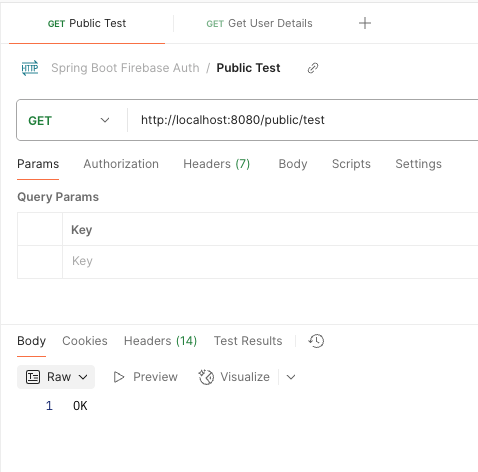
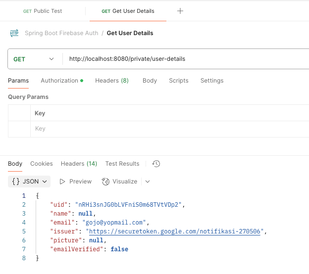
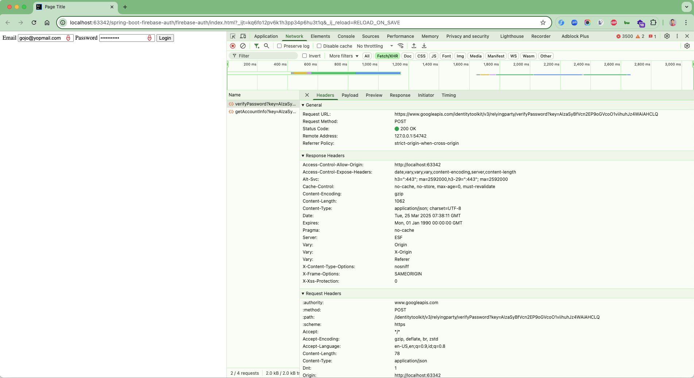

# Spring Boot Firebase Authentication

A comprehensive Spring Boot application demonstrating secure user authentication and authorization using Firebase Auth
with session-based security.

## 🚀 Features

- **Firebase Authentication Integration**: Complete JWT token validation and user management
- **Session-based Security**: Secure cookie-based session management with Spring Security
- **Public & Private Endpoints**: Role-based access control for different API endpoints
- **Database Integration**: H2 in-memory database with JPA support (MySQL ready)
- **CORS Configuration**: Proper cross-origin resource sharing setup
- **RESTful API**: Clean REST endpoints for authentication and user management
- **Frontend Integration**: Sample HTML/JavaScript login form

## 🛠️ Technology Stack

- **Java 21** - Latest LTS version
- **Spring Boot 3.4.4** - Main framework
- **Spring Security** - Authentication & authorization
- **Spring Data JPA** - Database operations
- **Firebase Admin SDK 9.4.3** - Firebase integration
- **H2 Database** - In-memory database (development)
- **MySQL** - Production database support
- **Maven** - Build tool
- **Lombok** - Code generation

## 📋 Prerequisites

- Java 21 or higher
- Maven 3.6+
- Firebase project with Authentication enabled
- Firebase service account key

## ⚙️ Configuration

### 1. Firebase Setup

1. Create a Firebase project at [Firebase Console](https://console.firebase.google.com/)
2. Enable Authentication with Email/Password
3. Generate a service account key:
    - Go to Project Settings → Service Accounts
    - Generate new private key
    - Save as `src/main/resources/notifikasi-270506-firebase-adminsdk-*.json`

### 2. Application Configuration

Update `src/main/resources/application.yml`:

```yaml
security:
  firebase-props:
    database-url: ${FIREBASE_DATABASE:your-project.firebasestorage.app}
  cookie-props:
    domain: ${DOMAIN:your-project.firebaseapp.com}
  allowed-origins:
    - https://${DOMAIN:your-project.firebaseapp.com}
    - http://localhost:3000
```

### 3. Frontend Configuration

Update `index.html` with your Firebase config:

```javascript
var firebaseConfig = {
    apiKey: "your-api-key",
    authDomain: "your-project.firebaseapp.com",
    projectId: "your-project-id",
    // ... other config
};
```

## 🏃‍♂️ Running the Application

### Using Maven

```bash
# Clone the repository
git clone <repository-url>
cd spring-boot-firebase-auth

# Run the application
mvn spring-boot:run
```

### Using JAR

```bash
# Build the application
mvn clean package

# Run the JAR
java -jar target/firebase-auth-0.0.1-SNAPSHOT.jar
```

The application will start on `http://localhost:8080`

## 🔌 API Endpoints

### Public Endpoints

| Method | Endpoint         | Description        |
|--------|------------------|--------------------|
| GET    | `/public/test`   | Test public access |
| GET    | `/favicon.ico`   | Favicon            |
| POST   | `/session/login` | User login         |

### Private Endpoints (Requires Authentication)

| Method | Endpoint                | Description                    |
|--------|-------------------------|--------------------------------|
| GET    | `/private/user-details` | Get authenticated user details |

## 🔐 Authentication Flow

1. **Frontend Login**: User enters credentials in `index.html`
2. **Firebase Auth**: Frontend authenticates with Firebase
3. **Token Exchange**: Send Firebase ID token to `/session/login`
4. **Session Creation**: Backend validates token and creates secure session
5. **API Access**: Use session cookie for subsequent API calls

### Sample Authentication Response

```json
{
  "kind": "identitytoolkit#VerifyPasswordResponse",
  "localId": "user-unique-id",
  "email": "user@example.com",
  "displayName": "",
  "idToken": "eyJhbGciOiJSUzI1NiIs...",
  "registered": true,
  "refreshToken": "AMf-vBxkMD_s8HHq...",
  "expiresIn": "3600"
}
```

## 📁 Project Structure

```
src/
├── main/
│   ├── java/id/my/hendisantika/firebaseauth/
│   │   ├── auth/              # Security configuration
│   │   │   ├── SecurityConfig.java
│   │   │   ├── SecurityFilter.java
│   │   │   └── SecurityService.java
│   │   ├── config/            # Application configuration
│   │   │   ├── FirebaseConfig.java
│   │   │   └── SpringConfig.java
│   │   ├── endpoint/          # REST controllers
│   │   │   ├── PublicEndpoints.java
│   │   │   └── PrivateEndpoint.java
│   │   ├── model/             # Data models
│   │   │   ├── User.java
│   │   │   ├── Credentials.java
│   │   │   └── *Properties.java
│   │   ├── util/              # Utilities
│   │   │   └── CookieUtils.java
│   │   └── SpringBootFirebaseAuthApplication.java
│   └── resources/
│       ├── application.yml    # Configuration
│       └── firebase-key.json  # Firebase service account
├── test/
└── index.html                 # Sample frontend
```

## 🛡️ Security Features

- **JWT Token Validation**: Secure Firebase token verification
- **Session Management**: HTTP-only, secure cookies
- **CORS Protection**: Configurable allowed origins
- **CSRF Protection**: Built-in Spring Security CSRF
- **Path-based Security**: Public/private endpoint separation

## 🔧 Development

### Database

- **Development**: H2 in-memory database (auto-configured)
- **Production**: MySQL support (uncomment in `application.yml`)

### Testing

```bash
mvn test
```

### Building

```bash
mvn clean package
```

## 📱 Frontend Usage

1. Open `index.html` in a browser
2. Enter email and password
3. Click "Login" to authenticate
4. Use the session for API calls

## 🖼️ Screenshots

| Public Endpoint           | Private Endpoint            | Web Interface       |
|---------------------------|-----------------------------|---------------------|
|  |  |  |

## 🐳 Docker Support

```dockerfile
FROM openjdk:21-jdk-slim
COPY target/*.jar app.jar
EXPOSE 8080
ENTRYPOINT ["java","-jar","/app.jar"]
```

## 📝 Environment Variables

| Variable            | Description           | Default                                 |
|---------------------|-----------------------|-----------------------------------------|
| `FIREBASE_DATABASE` | Firebase database URL | `notifikasi-270506.firebasestorage.app` |
| `DOMAIN`            | Application domain    | `notifikasi-270506.firebaseapp.com`     |

## 🤝 Contributing

1. Fork the repository
2. Create a feature branch
3. Commit your changes
4. Push to the branch
5. Create a Pull Request

## 📄 License

This project is licensed under the MIT License.

## 👤 Author

**Hendi Santika**

- Email: hendisantika@yahoo.co.id
- Telegram: @hendisantika34
- Link: [s.id/hendisantika](https://s.id/hendisantika)

## 🔗 Useful Links

- [Firebase Console](https://console.firebase.google.com/)
- [Spring Boot Documentation](https://docs.spring.io/spring-boot/docs/current/reference/html/)
- [Firebase Admin SDK](https://firebase.google.com/docs/admin/setup)